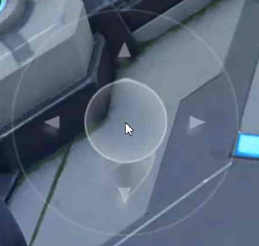

# Vjoy
因为手机玩游戏太卡所以用网易云游戏玩的时候发现不支持摇杆所以自己写了这个虚拟摇杆

# 使用

### 1.从[release](https://github.com/zhukongqwq/Vjoy/releases/latest)下载exe文件

### 2.运行exe文件

初次使用会要求设置摇杆中心坐标：

- 打开云游戏，进入有摇杆的游戏界面（建议全屏显示）

- 将鼠标放在摇杆中心位置，按下"Ctrl+Alt+S"键（先关闭设置提示的窗口再按键）

  

### 3.运行主程序

- 返回主界面
- 选择你的游戏窗口
- 按下开始，虚拟摇杆运行

由于作者水平有限，代码运行不是很流畅，可能存在一些bug，欢迎提出issue
