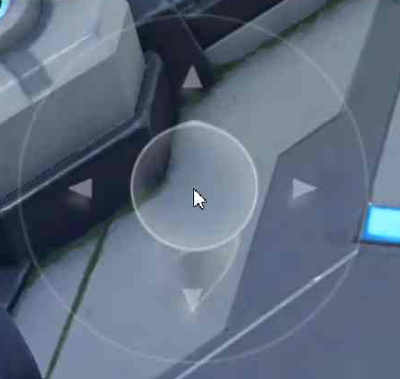

# Vjoy
因为手机玩游戏太卡所以用网易云游戏玩的时候发现不支持摇杆所以自己写了这个虚拟摇杆

# 使用

### 1.安装python（建议3.10及以上）

### 2.用git下载源码

```git
git clone https://github.com/zhukongqwq/Vjoy.git
```

### 3.pip安装所需库

```python
pip install -r r.txt
```

### 4.首先运行set_opos.py，获取摇杆中心坐标

- 打开云游戏，进入有摇杆的游戏界面（建议全屏显示）

- 将鼠标放在摇杆中心位置，用Alt+Tab快捷键切换到运行python文件的窗口（如cmd，python编辑器）并使用快捷键运行set_opos.py，选择你的云游戏窗口，**在此过程中不要移动鼠标**

  

### 5.运行vjoy.py

- 打开vjoy.py，用控制台输出的坐标替换o_pos的数据
- 运行vjoy.py，选择云游戏窗口
- 回到游戏，就可以用键盘操控摇杆了

由于作者水平有限，代码运行不是很流畅，可能存在一些bug，欢迎提出issue
